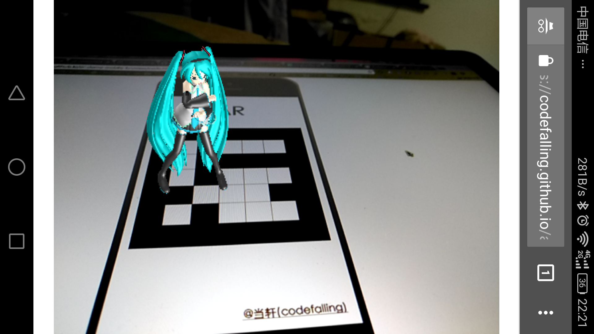

# ar-demo-mobile-browser
A AR demo on mobile browser(Android yet) powered by JavaScript

Access at: https://codefalling.github.io/ar-demo-mobile-browser

# SceenShot



# Build

```shell
webpack -p
```

# What about iOS

iOS (safari) do not support `MediaStreamTrack.getSources()`, `MediaDevices.enumerateDevices()` or whatever yet.

# Related Projects

- [js-aruco](https://github.com/jcmellado/js-aruco)

- [ARLIFXController](https://github.com/sitepoint-editors/ARLIFXController)

- [threex.webar](https://github.com/jeromeetienne/threex.webar)

- [threejs-mmd-loader](https://github.com/mrdoob/three.js/blob/dev/examples/webgl_loader_mmd.html)
